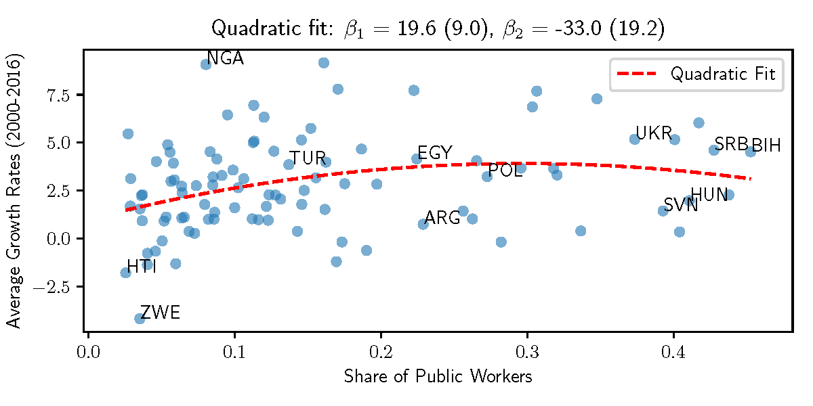

# Public Employment, Competition, and Economic Growth

> **Current Version:** [August 2020](/_versions/publicEmp_aug20.pdf)

> **Status:** Under Review

> **Abstract:** This paper shows that there is an inverted U-shaped relationship between public employment and economic growth. The government allocates workers to the production of public goods, which reduces operational costs, increasing the number of firms in the market, and creating incentives to innovate. Conversely, large public sectors crowd out the labor market, reducing the number of firms and the incentives to innovate.  An extension of the model shows that the average human capital of public workers has the same relationship with economic growth. Therefore, even countries with small public sectors can hinder economic growth by hiring many high-productivity workers. The paper also provides empirical evidence of an inverted U-shaped correlation between the share of public workers and economic growth using data from the Worldwide Bureaucracy Indicator and the Penn World Tables. Numerical exercises show that the model replicates the inverted U-shaped relationship between public employment and economic growth found in the data. 

